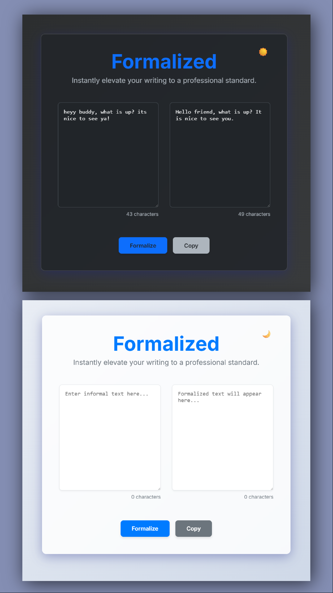

# Formalized

An AI-powered web application that instantly elevates your writing to a professional standard.



## Features

- **Text Formalization**: Converts informal text into a more professional and polished version using the Gemini API.
- **Dark Mode**: A sleek and eye-friendly dark mode for comfortable use in any lighting condition.
- **Character Count**: Keep track of your input and output text length with a real-time character counter.
- **Copy to Clipboard**: Easily copy the formalized text to your clipboard with a single click.

## Getting Started

### Prerequisites

- Node.js and npm (or yarn) installed on your machine.
- A Gemini API key. You can get one from the [Google AI for Developers website](https://ai.google.dev).

### Installation

1.  Clone the repository:
    ```bash
    git clone https://github.com/your-username/formalized-dot-ai.git
    ```
2.  Navigate to the project directory:
    ```bash
    cd formalized-dot-ai
    ```
3.  Install the dependencies:
    ```bash
    npm install
    ```
4.  Create a `.env` file in the root of the project and add your Gemini API key:
    ```
    VITE_GEMINI_API_KEY=your_api_key_here
    ```
5.  Start the development server:
    ```bash
    npm run dev
    ```

## Built With

- [React](https://reactjs.org/)
- [Vite](https://vitejs.dev/)
- [Google Gemini API](https://ai.google.dev)